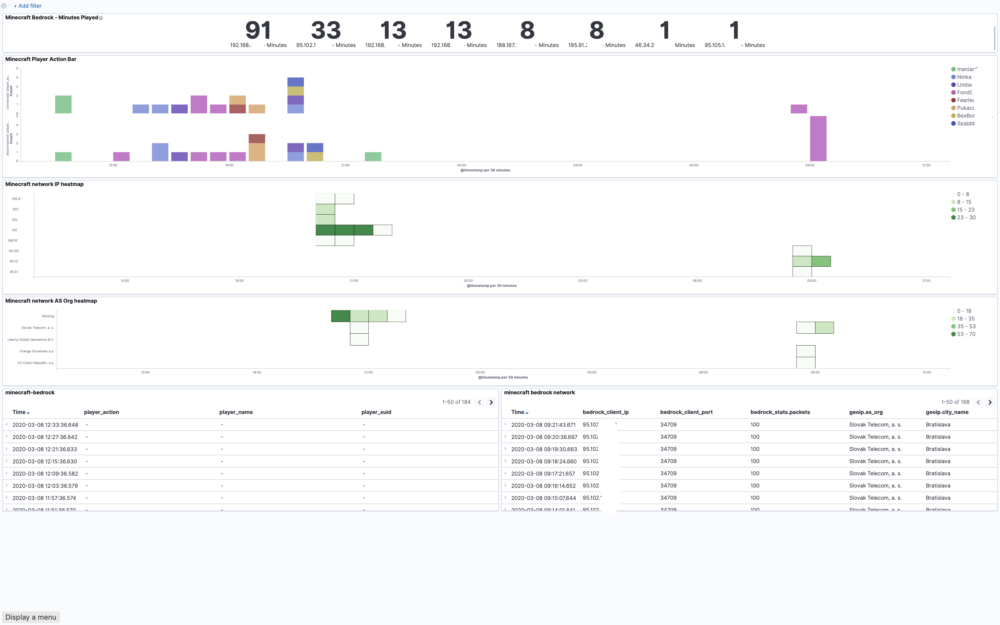

# bedrock-stats
Minecraft Bedrock server monitoring and statistics reporting

Data Inputs:
1. Log files created by the bedrock server to identify player join/disconnect
2. Network analysis (tcpdump) to identify IP address of connected players

Data Outputs:
1. optional output to InfluxDB
2. output network captures to /var/log/syslog via Kibana / Grafana (influxdb)

Representation:
1. Grafana (influx / elasticsearch)
2. Kibana (elasticsearch)

InfluxDB output Limitations:
I did not want to use InfluxDB TAGs as number of client IP addresses and their ports can raise uncontrollably during time so all metrics (ip, port and number of packets captured) are stored as series, not tags.
Therefore if you can, you should use ELK in this case over Influx.

Sample screenshot: 
